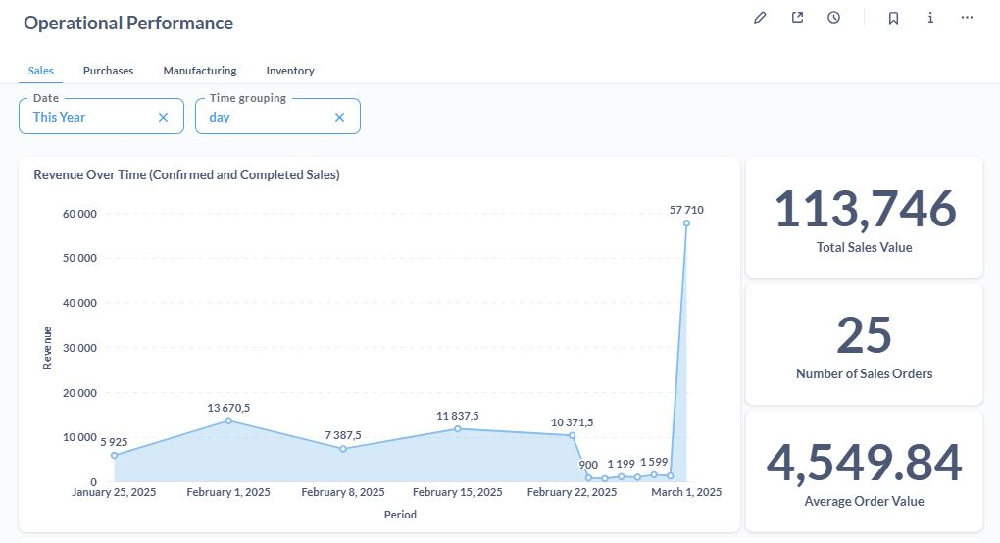
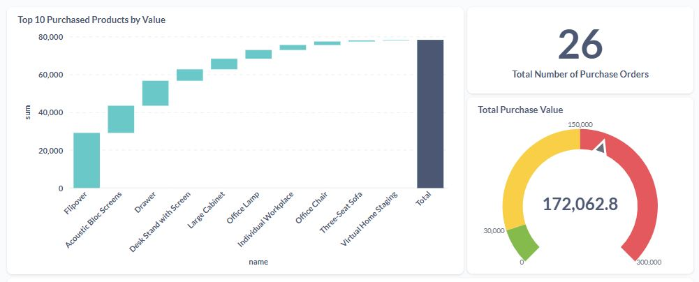
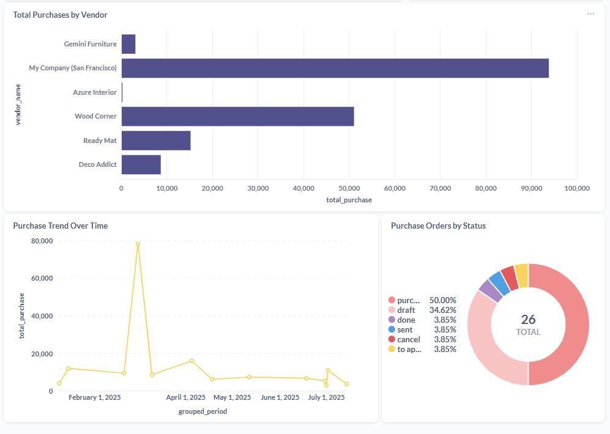

# Odoo-Metabase-BusinessDashboard

This project presents a complete Business Intelligence (BI) dashboard solution built using **Metabase**, connected to an **Odoo 13 ERP** PostgreSQL database. It was developed for a **food manufacturing company** and includes interactive dashboards covering the following operational domains:

- **Purchases**
- **Inventory**
- **Manufacturing**
- **Sales**

All SQL queries, visualizations, and documentation are original and reflect real business needs.
Each folder includes:
- The **SQL queries** used in Metabase
- A **screenshot** of the resulting chart
- A short **description** of each metric and its business value

---

## 🛠️ Tools & Technologies

- **Metabase** – for interactive data visualization and dashboards
- **PostgreSQL** – Odoo 13 database (data source)
- **Odoo 13 ERP** – for real-world ERP data
- **Docker** – used for local deployment and testing (optional)

---

## 📷 Visual Samples

Preview screenshots and charts are available in each domain folder. Example:

(These are just examples — full visuals and documentation are in the respective folders.)
